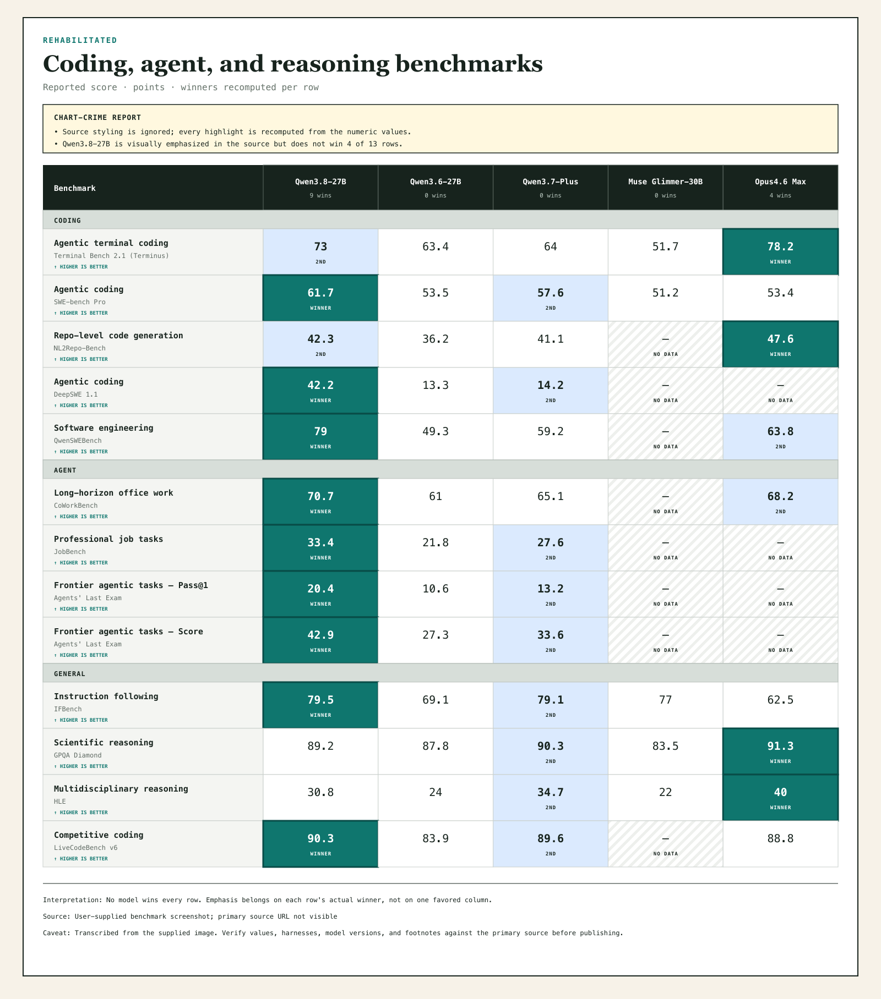

# Benchwarmer

**It does not run benchmarks. It stops their presentation from lying.**

Benchwarmer turns a pasted, dropped, photographed, or uploaded benchmark image—or a CSV, JSON document, or Markdown table—into a corrected comparison. It discards source coloring and bolding, recomputes winners per benchmark row, marks runners-up and missing data, and keeps the source, caveat, and interpretation attached. It runs locally in the browser; it does not upload your input.

Live: <https://benchwarm.ing> (with <https://bench.bac.al> and <https://benchwarmer.aronchick.workers.dev> as Cloudflare fallbacks).



## Clone-first install

```sh
git clone https://github.com/aronchick/benchwarmer.git
cd benchwarmer
npm test
npm run dev
```

Open the local URL that Wrangler prints. For production deployment, authenticate with Cloudflare and run `npm run deploy`.

## Portable specification and CLI

The public schema supports both a single ranked series and a multi-model benchmark matrix. Start with [examples/chart-crime.json](examples/chart-crime.json), which transcribes the included misleading-column example:

```sh
node bin/benchwarmer.mjs examples/chart-crime.json --out chart.html
```

The command validates the essential values, calculates winners from the data, and writes a self-contained HTML comparison with a chart-crime report and receipts. The website can export the same audit JSON plus SVG, PNG, and HTML.

For CSV or Markdown matrices, use one row per benchmark and one column per compared model. Optional `Detail`, `Group`, and `Direction` columns preserve context and support lower-is-better metrics:

```csv
Benchmark,Detail,Group,Direction,Model A,Model B
Accuracy,Eval v2,Quality,higher,91.2,93.4
Latency,p95,Speed,lower,120,95
```

## Screenshot workflow

On desktop, paste an image from the clipboard or drag it onto the intake box. On mobile, paste an image where supported, choose one from the photo library, or use **Take a photo**. Press **Extract & rehabilitate** to run positional OCR in the browser, infer rows and model columns, and produce an editable corrected comparison.

The OCR library and English language model are downloaded on first use, but the benchmark image itself stays in the browser. OCR is a draft, not evidence: review every extracted value against the primary source. For agent-assisted extraction, use [skills/benchwarmer/SKILL.md](skills/benchwarmer/SKILL.md).

## Publishing rule

A highlight is a claim. It must follow the declared direction and numeric values for that row—not a product-favored column. Preserve the primary benchmark source, version, conditions, directionality, and material caveats before using a comparison in a decision or public post.
